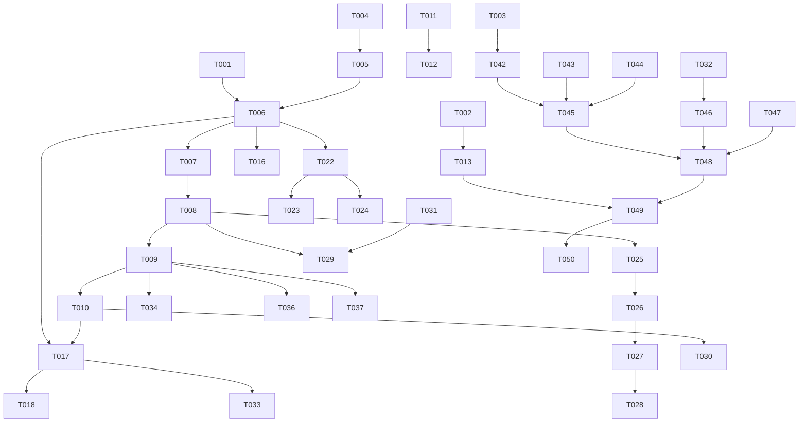

# Tasks: TiXing 工程全面优化（安全/数据/性能/功能/质量）

**Input**: Design documents from `spec/project-optimization/`
**Prerequisites**: plan.md (required), spec.md (required for user stories)
**Tests**: 未要求专门测试任务；验证以构建+部署为准（build-only）

**Organization**: 任务按用户故事（US1–US8）分组，支持独立实现与独立验证。

## Format: `[ID] [P?] [Story] Description`

- **[P]**: 可并行（不同文件、无未完成依赖）
- **[Story]**: 所属用户故事（US1–US8）
- 描述均带具体文件路径

## Path Conventions

- 源码根：`entry/src/main/ets/`（下文以 `ets/` 简写）
- 资源根：`entry/src/main/resources/`（下文以 `res/` 简写）
- 工程根：`/Users/dfx/TiXing`

---

## Phase 1: Setup (Shared Infrastructure)

**Purpose**: 全部故事共享的代码基建（轻量类型、配置读取器、颜色资源）

- [x] T001 [P] 新建轻量操作结果类型 DbResult（ok/fail + op + reason，全静态工厂）于 ets/common/DbResult.ets
- [x] T002 [P] 新建密钥配置读取器 AiConfig（load/apiKey/model/configured，读 rawfile JSON，缺失安全降级）于 ets/common/AiConfig.ets，并在 res/rawfile/ 提交模板 ai_config.example.json（含填写说明）
- [x] T003 [P] 新建全量颜色资源（亮色）于 res/base/element/color.json，并新建对应深色配色于 res/dark/element/color.json（页面硬编码色逐个映射：页面底/卡片/主色/文本两级/辅助/分割线/Chip 两态/阴影等）

---

## Phase 2: Foundational (Blocking Prerequisites)

**Purpose**: DatabaseHelper 核心改造——被 US2/US5/US6/US7/US8 共同依赖，必须先于故事实施完成

**⚠️ CRITICAL**: 故事阶段开始前本阶段必须全部完成

- [x] T004 单例收敛（constructor 私有化 + 静态 getInstance，保留导出常量 dbHelper）与 Context 显式导入（common.Context），改造 ets/repository/DatabaseHelper.ets
- [x] T005 init 幂等化：缓存就绪 Promise、新增 whenReady()、全部公开读写方法入口 await 就绪（ensureReady 全局兜底）、init 失败返回 DbResult 并记致命日志，改造 ets/repository/DatabaseHelper.ets
- [x] T006 统一错误处理：内部新增带 hilog 的执行封装，全部写操作（insertMistake/updateMistake/deleteMistake/insertPointsLog/insertReviewLog/insertRedemption/saveReminderSettings/upsertKnowledgeProfile/insertAnalyticsEvent 等）返回 Promise<DbResult>，清零空 catch；读列辅助函数区分失败与默认值并记日志，改造 ets/repository/DatabaseHelper.ets
- [x] T007 版本化迁移：getRdbStore 后读取并写入 PRAGMA user_version（基线 v2），存量库执行幂等 ALTER 合集，新建库直接建最新结构；新增 8 个索引（CREATE INDEX IF NOT EXISTS：mistake.nextReviewDate / mistake.studentId / review_log.mistakeId / review_log(studentId,occurredAt) / points_log.studentId / analytics_event.eventType / knowledge_profile.studentId / redemption.studentId），迁移失败上报，改造 ets/repository/DatabaseHelper.ets
- [x] T008 事务化：deleteMistake（错题+复习日志同事务）、seedKnowledgeTags 批量事务、upsertKnowledgeProfile 与 saveReminderSettings 的 update-then-insert 事务化，改造 ets/repository/DatabaseHelper.ets
- [x] T009 查询升级：queryMistakes 增加 offset/limit 分页参数；新增 queryMistakeStats（按状态 GROUP BY）；queryPointsSummary 改 SQL SUM 与 COUNT（streakDays 字段改为由调用方注入真实值）；新增 queryActiveDays（DISTINCT 活动日）；queryTodayReviewMistakes 增加 studentId 过滤 + dailyLimit 截断 + 科目开关过滤参数；queryReviewLogs 增加按学生批量查询接口，改造 ets/repository/DatabaseHelper.ets
- [x] T010 updateMistake 更新集合补充 imageUrl 列；rowToMistake 读取失败不再返回半初始化对象（整行跳过并记日志），改造 ets/repository/DatabaseHelper.ets

**Checkpoint**: 数据层基建完成，全部故事可开始

---

## Phase 3: User Story 1 - 安全合规整改 (Priority: P1) 🎯

**Goal**: 密钥/签名/仓库卫生/混淆四项安全整改落地
**Independent Test**: `git grep` 无密钥明文；`git status` 无待误提交敏感文件；release 混淆构建成功

- [x] T011 [US1] .gitignore 追加 /Key/、/.cache/、.DS_Store、/App截图/、res/rawfile/ai_config.json；执行 git rm --cached 移除已追踪 .cache 产物；根 build-profile.json5 签名密码出库（本地文件保留、仓库无明文），更新 /Users/dfx/TiXing/.gitignore
- [x] T012 [P] [US1] 落地本地密钥配置文件（从模板复制结构、密钥留空由用户填写）于 res/rawfile/ai_config.json
- [x] T013 [US1] AiService 移除硬编码 API_KEY 改用 AiConfig（未配置时返回带指引的明确错误），parseQuestion/parseAnalysis 捕获并携带失败原因，HTTP 错误信息附带响应体摘要，改造 ets/services/AiService.ets
- [x] T014 [P] [US1] release 构建启用混淆（obfuscation.enable=true，沿用既有规则文件），改造 entry/build-profile.json5
- [x] T015 [P] [US1] INTERNET 权限补 reason（$string:reason_internet）与 usedScene，同步补文案于 res/base/element/string.json 与 entry/src/main/module.json5

**Checkpoint**: US1 完成——仓库与发布包零明文密钥

---

## Phase 4: User Story 2 - 数据写入可靠与错误可见 (Priority: P1) 🎯

**Goal**: 首屏数据可靠、写失败可见、复习提交原子化
**Independent Test**: 冷启动首屏必有数据；构造写失败场景页面如实报错；连续复习提交无状态覆盖

- [x] T016 [US2] Index.ets 改为 await dbHelper.whenReady() 后再触发 Tab 加载、init 失败 Toast+日志、applyReminder 补 catch，改造 ets/pages/Index.ets
- [x] T017 [US2] 新建原子复习提交用例 ReviewSubmitter.submit（串行：插入日志→查询全部日志→掌握判定→单次终态 updateMistake→按 clientOperationId 幂等发积分→返回提交结果），新建 ets/usecases/ReviewSubmitter.ets
- [x] T018 [US2] ReviewPage 接入 ReviewSubmitter（移除页面层多步 DB 编排）、修复无 catch 的 then、增加页面销毁防护（alive 标记）、知识画像重算移至会话结束（onBackPress/完成时一次性触发），改造 ets/pages/ReviewPage.ets
- [x] T019 [P] [US2] CapturePage saveMistake 检查 DbResult、失败如实提示不进入成功页；capturePhoto 加 try/finally 保护 capturing 复位，改造 ets/pages/CapturePage.ets
- [x] T020 [P] [US2] KnowledgeProfileAggregator 改按 studentId 数据库过滤（不再全表内存 filter）、已删标签的僵尸画像清零、批量 upsert，改造 ets/usecases/KnowledgeProfileAggregator.ets
- [x] T021 [P] [US2] 设置类页面保存路径检查 DbResult 并如实提示（ProfileSettingPage.saveProfile、PointsCenterPage 兑换、DataManagementPage 导入导出入口），改造 ets/pages/ProfileSettingPage.ets、ets/pages/PointsCenterPage.ets、ets/pages/DataManagementPage.ets

**Checkpoint**: US2 完成——零假成功、首屏可靠、复习原子化

---

## Phase 5: User Story 3 - 复习提醒真实可用 (Priority: P1)

**Goal**: 权限申请→发布→重启不叠加→时间段可编辑全链路可用
**Independent Test**: 真机保存提醒→弹权限→通知出现；重启无重复；点击时间段可修改

- [x] T022 [US3] ReminderService 新增 ensurePermission（requestPermissionsFromUser，永久拒绝返回 false 供引导）与 syncAndApply（getValidReminders 清光重建 + reminderId 写入 Preferences + 发布/取消失败如实上抛 + 行动按钮 wantAgent 拉起应用），改造 ets/services/ReminderService.ets
- [x] T023 [US3] ReminderSettingPage 时间段点击弹 TimePicker 可修改并保存、保存前调用 ensurePermission（拒绝时引导跳系统设置）、保存结果按真实 DbResult 展示、清理误导文案与 statusMsg 双提示，改造 ets/pages/ReminderSettingPage.ets
- [x] T024 [US3] Index.ets applyReminder 改用 ReminderService.syncAndApply 并处理失败日志，改造 ets/pages/Index.ets

**Checkpoint**: US3 完成——提醒链路真实可用

---

## Phase 6: User Story 4 - 数据导入导出完整可信 (Priority: P1)

**Goal**: zip 备份包含错题+复习记录+图片；失败如实报错；大文件不卡 UI
**Independent Test**: 导出→清空→导入往返数据一致（含复习记录与图片）；选超大文件 UI 不冻结

- [x] T025 [US4] DataPortabilityService 重写导出为 exportBundle（临时目录组织 manifest.json+data.json+images/ → @ohos.zlib compressFile 打包单 zip；含复习记录批量查询；写失败抛出；导出目录仅保留最近 3 份），改造 ets/services/DataPortabilityService.ets
- [x] T026 [US4] DataPortabilityService 新增 parseBundlePreview 异步解析（taskpool 执行、10MB 上限、manifest app/version 校验、stat 预检），改造 ets/services/DataPortabilityService.ets
- [x] T027 [US4] DataPortabilityService 新增 importBundle（decompressFile 至沙箱临时目录→恢复错题+复习日志（按 mistakeId+clientOperationId 去重）+图片落 filesDir/mistakes 并回填 imageUrl+提醒设置，事务写入，失败回滚上报），改造 ets/services/DataPortabilityService.ets
- [x] T028 [US4] DataManagementPage 对接新异步接口（busy 全程保护、进度/失败如实展示、清理 importPath 死状态），改造 ets/pages/DataManagementPage.ets

**Checkpoint**: US4 完成——备份往返一致可信

---

## Phase 7: User Story 5 - 误操作保护与数据一致性 (Priority: P2)

**Goal**: 删除有确认且原子；重识别图片路径正确落库
**Independent Test**: 滑动删除弹确认；重识别保存后新图片持久

- [x] T029 [US5] MistakesPage 滑动删除增加 AlertDialog 二次确认（确认后调用事务化 deleteMistake 并联动删图），改造 ets/pages/MistakesPage.ets
- [x] T030 [P] [US5] MistakeDetailPage 重识别保存走含 imageUrl 的 updateMistake、按钮文案与实际行为一致（相册选择）、清理死状态与未使用导入、查询失败空态处理，改造 ets/pages/MistakeDetailPage.ets
- [x] T031 [P] [US5] MediaService 新增 deleteImageIfOwned（startsWith 精确路径判断）并在 MistakesPage/MistakeDetailPage 删除流程调用，改造 ets/services/MediaService.ets

**Checkpoint**: US5 完成——误操作有保护、数据一致

---

## Phase 8: User Story 6 - 半成品功能收口 (Priority: P2)

**Goal**: OCR 核对提醒可触发；streak 真实计算；dailyLimit/科目开关生效；学科检测与判分修正
**Independent Test**: 低置信度出现核对提示；连续使用 streak 递增且发分一次/天；上限与开关生效；语文题不再误判

- [x] T032 [US6] CaptureOrchestrator 传递真实 OCR 置信度（接口返回值或按文本质量评估）、图片质检改 fail-closed（解码失败/异常不放行）、CapturePage 接收低置信度并展示"需人工核对"提示，改造 ets/usecases/CaptureOrchestrator.ets 与 ets/pages/CapturePage.ets
- [x] T033 [US6] 新建 StreakCalculator（compute 按日去重连续天数、shouldAwardToday 当日去重发分判断），并在 ReviewSubmitter 与 CapturePage 保存流程挂钩发放 STREAK 积分、PointsCenterPage 展示真实 streakDays，新建 ets/usecases/StreakCalculator.ets 并改造 ets/pages/PointsCenterPage.ets
- [x] T034 [US6] ReviewPage/HomePage 复习队列消费新参数（studentId + ReminderSettings.dailyLimit + 科目开关），改造 ets/pages/ReviewPage.ets 与 ets/pages/HomePage.ets
- [x] T035 [US6] SubjectDetector 全角括号不再计为运算符、新增科学学科识别分支（特征词表）；Constants 新增答案归一化函数（trim/大小写/全半角/内空格）并接入 ReviewPage 判分与选项解析，改造 ets/usecases/SubjectDetector.ets、ets/common/Constants.ets、ets/pages/ReviewPage.ets

**Checkpoint**: US6 完成——功能落差收口

---

## Phase 9: User Story 7 - 性能与资源优化 (Priority: P2)

**Goal**: 索引/聚合/懒加载/降采样/资源释放/临时文件清理落地
**Independent Test**: 500+ 错题下列表流畅；统计页秒开；反复拍照取消无残留文件

- [x] T036 [US7] HomePage/ReportPage/OpsOverviewPage 统计改 queryMistakeStats 聚合调用（移除全量 queryMistakes+filter），recent 列表限制条数，改造 ets/pages/HomePage.ets、ets/pages/ReportPage.ets、ets/pages/OpsOverviewPage.ets
- [x] T037 [US7] MistakesPage 改 LazyForEach + 自定义 IDataSource（键值用 mistake.id，正确调用数据变更通知）+ 触底分页加载 + loading/失败态，改造 ets/pages/MistakesPage.ets
- [x] T038 [P] [US7] 图片降采样：列表缩略图与详情/裁剪大图增加 sourceSize/alt（按显示尺寸解码），改造 ets/pages/HomePage.ets、ets/pages/CapturePage.ets、ets/pages/MistakeDetailPage.ets
- [x] T039 [P] [US7] MediaService 全部资源获取路径 try/finally 释放（fd close / imageSource release / pixelMap release）、persistUri 失败返回 undefined 不降级临时 uri、新增 cleanupTemp（拍照取消/失败清理 savePath），改造 ets/services/MediaService.ets
- [x] T040 [P] [US7] PointsCenterPage 明细改聚合查询与 PointsActionType 常量映射、AnalyticsTracker track* 补 catch 且 inputMethod 不再内插裸 JSON、PerformanceMonitor 补 Promise rejection 处理，改造 ets/pages/PointsCenterPage.ets、ets/usecases/AnalyticsTracker.ets、ets/services/PerformanceMonitor.ets

**Checkpoint**: US7 完成——随数据增长不退化

---

## Phase 10: User Story 8 - 代码质量与 UI 债 (Priority: P3)

**Goal**: 深色模式资源化、公共组件提炼、CapturePage 拆分、死代码清零
**Independent Test**: 深色模式全页面无白块；grep 无硬编码 hex；CapturePage 行数显著下降且功能不回退

- [x] T041 [P] [US8] EntryAbility 处理 onConfigurationUpdate（深色切换）、日志改业务 tag 与非零 domain；Toast 改为从 AppContextHolder 实时获取 UIContext（不再静态持有），改造 ets/entryability/EntryAbility.ets 与 ets/common/Toast.ets
- [x] T042 [P] [US8] Constants.ets AppColors 改为 $r 资源引用（调用点 API 不变，异常时降级静态方法获取）并补充深色阴影/Chip 两态等缺口常量，改造 ets/common/Constants.ets
- [x] T043 [P] [US8] 新建公共基础组件库 BasicWidgets（FilterChip/PrimaryButton/AppCard/SectionCard/EmptyBlock，资源色+触摸区≥44vp+accessibilityText），新建 ets/components/BasicWidgets.ets
- [x] T044 [P] [US8] 新建 GradientHeader（渐变头图+状态栏避让内聚，SystemBarHelper 结果静态缓存）与 MistakeCard（两级标题截断+科目/状态标签+降采样缩略图），新建 ets/components/GradientHeader.ets 与 ets/components/MistakeCard.ets
- [x] T045 [US8] 全部页面接入公共组件并清零硬编码颜色（HomePage/ProfilePage/ReportPage 复用 GradientHeader；MistakesPage/HomePage 复用 MistakeCard；各页 Chip/按钮/卡片/空态复用 BasicWidgets；PageHeader 合并 PageTitle 并补无障碍），改造 ets/pages/*.ets 与 ets/components/CommonComponents.ets
- [x] T046 [US8] 新建 CaptureSteps（SourceSelect/RegionSelect/OcrConfirm/ResultView 四步子组件，各持步骤状态），CapturePage 瘦身为流程编排+持久化、补 alive 防护与返回上一步入口、清理死状态（isConfirmed/hintMsg 等），新建 ets/components/CaptureSteps.ets 并改造 ets/pages/CapturePage.ets
- [x] T047 [P] [US8] 死代码与重复收敛：未使用导入清零、RouteParams 未用类型删除、resetMastery 删除、RedeemableItem.owned 迁出持久化模型、不可达枚举核查处置、标题截断/日期格式化统一进 Constants、缺口文案补 AppStrings 常量，改造 ets/common/RouteParams.ets、ets/usecases/MasteryEvaluator.ets、ets/models/RedeemableItem.ets、ets/models/Enums.ets、ets/common/Constants.ets 及相关页面

**Checkpoint**: US8 完成——质量债清偿

---

## Phase 11: Polish (Cross-Cutting Concerns)

**Purpose**: 全局收尾与一致性自查

- [x] T048 全局自查：grep 校验源码无残留硬编码 hex 颜色、无未使用导入、无遗留 TODO 空实现标记；AppStrings 覆盖页面裸文案；核对 main_pages.json 无需变更（无新增页面），执行于 /Users/dfx/TiXing 工程根

---

## Phase 12: Verification

<!-- verification_scope: build-only -->

**Purpose**: 构建与部署验证（用户已选择 build-only 范围）

- [x] T049 Build project and fix any compilation errors (invoke build_project; iterate fix → build until success)
- [x] T050 Deploy application to device/emulator (invoke start_app)

---

## Dependencies & Execution Order

### Phase Dependencies

- **Setup (Phase 1)**: 无依赖，立即开始（T001/T002/T003 相互独立可并行）
- **Foundational (Phase 2)**: 依赖 T001（DbResult）；T004–T010 同文件串行执行——**阻塞全部故事**
- **US1 (Phase 3)**: 依赖 T002（AiConfig）；T011 完成后 T012–T015 可并行
- **US2 (Phase 4)**: 依赖 Phase 2 全部；T017 依赖 T006/T009/T010；T016/T019/T020/T021 可并行
- **US3 (Phase 5)**: 依赖 T006；T024 依赖 T022
- **US4 (Phase 6)**: 依赖 T006/T008；T028 依赖 T025–T027
- **US5 (Phase 7)**: 依赖 T008（删除事务）/T010（imageUrl）；T029/T030/T031 可并行（T029 调用 T031 定义的接口）
- **US6 (Phase 8)**: 依赖 T009（复习队列参数）/T017（ReviewSubmitter 挂钩）；T032–T035 大体可并行（T033 依赖 T017）
- **US7 (Phase 9)**: 依赖 T009（分页/聚合）；T037 依赖 T009；T036/T038/T039/T040 可并行
- **US8 (Phase 10)**: 依赖 T003（颜色资源）；T045 依赖 T043/T044；T046 依赖 T032（OCR 提示位）；T041/T042/T043/T044/T047 可并行
- **Polish (Phase 11)**: 依赖全部故事完成
- **Verification (Phase 12)**: 依赖 Phase 11

### User Story Dependencies

- US1–US8 相互独立（均只依赖 Foundational），可并行推进或按 P1→P2→P3 顺序执行
- 例外交叉点：T018（US2）为 T033（US6）提供挂钩；T029（US5）联动 T031——均已显式排序

### Within Each User Story

- 基础设施/服务层先行，页面接入在后
- 每个故事完成后可独立验证（见各 Checkpoint）

## 📊 Dependency Graph



## ⚡ Parallel Execution Guide

| Phase | Tasks | Required Files | Execution Notes |
|-------|-------|----------------|-----------------|
| Setup | T001, T002, T003 | ets/common/DbResult.ets、ets/common/AiConfig.ets、res/**/color.json | 三任务不同文件，可并行 |
| Foundational | T004–T010 | ets/repository/DatabaseHelper.ets | 同文件必须串行 |
| US1 | T012, T013→T014, T015 | res/rawfile/、ets/services/AiService.ets、entry/build-profile.json5、module.json5 | T011 完成后并行 |
| US2 | T016, T019, T020, T021 | ets/pages/Index.ets、CapturePage.ets、KnowledgeProfileAggregator.ets、设置页 | 不同文件可并行（T017/T018 串行对） |
| US3 | T022→(T023, T024) | ets/services/ReminderService.ets、ReminderSettingPage.ets、Index.ets | T023/T024 依赖 T022 |
| US4 | T025→T026→T027→T028 | ets/services/DataPortabilityService.ets、DataManagementPage.ets | 服务层串行，页面最后 |
| US5 | T029, T030, T031 | MistakesPage.ets、MistakeDetailPage.ets、MediaService.ets | 可并行（T029 调 T031 接口需其先定义） |
| US6 | T032, T033, T034, T035 | CaptureOrchestrator/CapturePage、StreakCalculator、ReviewPage/HomePage、SubjectDetector/Constants | 大体并行，T033 需 T017 完成 |
| US7 | T036, T038, T039, T040 | 各统计页、MediaService、PointsCenter/AnalyticsTracker | 不同文件可并行 |
| US8 | T041, T042, T043, T044, T047 | EntryAbility/Toast、Constants、BasicWidgets、GradientHeader/MistakeCard、模型清理 | 可并行；T045/T046 依赖组件就绪 |
| Verification | T049→T050 | 工程根 | 构建→部署串行 |

## Parallel Example

```bash
# Setup 阶段三个任务并行启动（不同文件、无依赖）:
Task: "新建 DbResult 于 ets/common/DbResult.ets"
Task: "新建 AiConfig 于 ets/common/AiConfig.ets + ai_config.example.json"
Task: "新建 color.json（base+dark）于 res/"

# US8 组件基建并行启动:
Task: "新建 BasicWidgets 于 ets/components/BasicWidgets.ets"
Task: "新建 GradientHeader/MistakeCard 于 ets/components/"

# Foundational 阶段（T004–T010）同文件，必须单线程串行执行
```

## Implementation Strategy

### MVP First (P1 故事)

1. 完成 Phase 1 Setup + Phase 2 Foundational
2. 依次完成 US1（安全）→ US2（数据可靠）→ US3（提醒）→ US4（导入导出）
3. **STOP and VALIDATE**: 四个 P1 故事独立验证后即可交付一个安全可用的版本

### Incremental Delivery

1. Setup + Foundational → 基建就绪
2. 加入 US1 → 独立验证（MVP 安全闭环）
3. 加入 US2 → 独立验证 → 可交付
4. 加入 US3/US4 → 独立验证
5. P2 故事（US5/US6/US7）→ P3（US8）→ Polish → Verification
6. 每个故事独立增值且不破坏已完成故事

### Sequential Execution Strategy（单实施者推荐）

1. T001–T003（并行/快速）→ T004–T010（串行核心）
2. 按 T011→…→T047 编号顺序执行（已按依赖排好）
3. T048 自查 → T049 构建 → T050 部署

## Notes

- [P] 任务 = 不同文件、无未完成依赖
- [Story] 标签将任务映射到 spec.md 的用户故事，保证可追溯
- 每个用户故事可独立完成并独立验证（各 Checkpoint）
- DatabaseHelper（Phase 2）为全局串行瓶颈，优先完成
- 按任务或逻辑组提交 commit；任意 Checkpoint 可停下独立验证故事
- 避免：模糊任务、同文件冲突、破坏故事独立性的跨故事依赖
- 用户需自行完成（代码之外）：①智谱平台吊销旧 Key；②新 Key 填入 res/rawfile/ai_config.json（不入库）
- 真机能力验证（提醒/OCR/拍照）超出本次 build-only 范围，建议后续手动验证

---

## Summary Report

- **总任务数**: 50（T001–T050）
- **按阶段**: Setup 3 / Foundational 7 / US1 5 / US2 6 / US3 3 / US4 4 / US5 3 / US6 4 / US7 5 / US8 7 / Polish 1 / Verification 2
- **按故事**: US1=5, US2=6, US3=3, US4=4, US5=3, US6=4, US7=5, US8=7（Setup/Foundational/Polish/Verification 13 项为共享基建与收尾）
- **并行机会**: Setup 3 任务、各故事内多任务、跨故事（Foundational 完成后）均存在并行面（见上表）
- **独立测试标准**: 每故事 Checkpoint 均给出可独立执行的验证方式
- **建议 MVP 范围**: Setup + Foundational + US1 + US2（安全与数据可靠优先闭环）
